# HCP Hybrid Recommender System — v0.1

[](https://www.python.org/)
[](https://www.tensorflow.org/)
[](https://streamlit.io/)
[](https://spacy.io/)
[](LICENSE)

**[Launch Streamlit Dashboard → HCP Hybrid Recommender System](https://hcp-hybrid-recommender-system-v01-dashboard.streamlit.app/)**  

---

## Project Overview

The **HCP Hybrid Recommender System (v0.1)** is a **data-driven healthcare marketing engine** designed to recommend the **Next Best Content (NBC)** and **Next Best Channel (NBC)** for Healthcare Professionals (HCPs).  

The system integrates **Deep Learning (LSTM)**, **Topic Modeling (NLP)**, and **Collaborative + Content-Based Filtering** to generate **personalized, context-aware recommendations**.  
It represents a **complete end-to-end pipeline** — from **data ingestion, preprocessing, and model training** to **deployment through a Streamlit dashboard**.

---

## Table of Contents
- [Purpose](#purpose)
- [Deep Learning for HCP Recommendation](#deep-learning-for-hcp-recommendation)
- [Tools & Technologies](#tools--technologies)
- [Data Sources & Synthesis](#data-sources--synthesis)
- [About the HCP Hybrid Recommendation System](#about-the-hcp-hybrid-recommendation-system)
- [System Architecture](#system-architecture)
- [Why Hybrid Modeling?](#why-hybrid-modeling)
- [Streamlit Dashboard Overview](#streamlit-dashboard-overview)
- [Repository Structure](#repository-structure)
- [Deployment Guide](#deployment-guide)
- [License](#license)

---

## Purpose

Pharmaceutical companies engage with thousands of HCPs across multiple channels — email campaigns, webinars, and scientific content distribution.  
Determining the **most relevant content**, **optimal delivery channel**, and **right timing** for each HCP is a persistent challenge.

This project aims to:

- Build a **hybrid recommender system** that integrates behavioral, textual, and contextual data.
- Predict the **Next Best Content (NBC)** and **Next Best Channel (NBC)** to drive meaningful engagement.
- Demonstrate a **scalable, interpretable deep learning framework** for healthcare marketing personalization.

---

## Deep Learning for HCP Recommendation

The core of the system is a **Hybrid LSTM Model** that fuses three complementary components:

| Component | Methodology | Description |
|------------|-------------|--------------|
| **Sequential Modeling** | Long Short-Term Memory (LSTM) | Learns temporal patterns in HCP–content engagement |
| **Scientific Content Understanding** | Topic Modeling (LDA) | Represents PubMed abstracts in topic space |
| **Collaborative Filtering** | Matrix-based scoring | Captures peer-level engagement similarity among HCPs |

This integrated architecture enables **personalized, explainable, and data-rich recommendations** by combining temporal, semantic, and behavioral learning.

---

## Tools & Technologies

| Category | Tools/Frameworks |
|-----------|------------------|
| **Programming Languages** | Python 3.11, SQL |
| **Machine Learning** | Pandas, NumPy, Scikit-learn, TensorFlow/Keras |
| **NLP & Topic Modeling** | spaCy, Gensim (LDA), NLTK |
| **Visualization** | Matplotlib, Seaborn, Plotly |
| **App & Deployment** | Streamlit |
| **Serialization** | Pickle, JSON |
| **Version Control** | Git, GitHub |

---

## Data Sources & Synthesis

### 1. PubMed Scientific Data  
Scientific abstracts (2020–2025) were extracted from **PubMed** and processed through a standard NLP pipeline — tokenization, lemmatization, and topic extraction using **Latent Dirichlet Allocation (LDA)**.  
The resulting topic embeddings represent the **semantic context** of scientific content, ensuring relevance-based recommendations.

### 2. Synthetic Real-World Data  
To simulate pharmaceutical engagement data, synthetic datasets were created for:
- [`hcp_master.csv`](data/hcp_master.csv): HCP demographics, specialty, and prescribing behavior  
- [`patients_with_hcp.csv`](data/patients_with_hcp.csv): Patient–HCP linkages  
- [`campaigns_with_content.csv`](data/campaigns_with_content.csv): Content metadata and delivery channels  
- [`hcp_interaction_data.csv`](data/hcp_interaction_data.csv): Engagement histories used for model training  

These synthetic datasets replicate the **multi-dimensional nature of Real-World Evidence (RWE)** used in healthcare analytics.

---

## About the HCP Hybrid Recommendation System

The **HCP Hybrid Recommender System** is a **multi-modal deep learning architecture** built for healthcare marketing personalization.  
It learns from **past interactions, scientific content semantics, and peer behaviors** to predict:

- The most relevant scientific content for each HCP  
- The most effective engagement channel (email, webinar, digital, call)  

Unlike traditional recommenders, it combines **time-series behavioral modeling**, **semantic understanding**, and **collaborative learning** for a holistic recommendation strategy.

---

### System Architecture

```mermaid
flowchart TD
A[Raw Data] -->|Preprocessing| B[Feature Engineering]
B --> C1[LDA Topic Modeling]
B --> C2[HCP–Content Matrix]
B --> C3[Sequential Interaction Data]
C1 --> D[Feature Fusion Layer]
C2 --> D
C3 --> D
D --> E[Hybrid LSTM Model]
E --> F[Top-N Content Recommendations]
E --> G[Channel Probability Prediction]
F --> H[Streamlit Dashboard Visualization]
```



## Modeling Flow

1. Process raw engagement, campaign, and scientific data.
2. Extract embeddings from **LDA**, **LSTM**, and **collaborative matrices**.
3. Fuse all representations through a **dense feature fusion layer**.
4. Predict **Next Best Content (NBC)** and **Next Best Channel (NBC)** for each HCP.

---

## Why Hybrid Modeling?

Healthcare marketing data spans **behavioral**, **semantic**, and **contextual** dimensions.  
A single modeling approach often fails to capture the full picture.

| Model Type | Limitation | Hybrid Solution |
|------------|-----------|----------------|
| Collaborative Filtering | Ignores text semantics and sequence behavior | Combined with NLP and temporal modeling |
| Content-Based Models | Lack peer-level learning | Augmented by collaborative similarity |
| Sequential Models (LSTM) | Learn patterns but not content meaning | Enriched with topic and similarity embeddings |

The hybrid approach creates a **balanced model** capable of learning both *what* an HCP engages with and *why*, ensuring **scientifically relevant, data-driven recommendations**.

---

## HCP Recommender Dashboard Overview (Streamlit-Based)

The Streamlit-based dashboard provides an interactive interface for exploring model outputs and engagement insights.

### Key Features

- **HCP-Level Recommendations:** Displays Top-N recommended content and predicted channels.  
- **Engagement Analytics:** Visualizes historical interaction patterns, engagement rates, and channel effectiveness.  
- **Topic Insights:** Generates interpretable topic clusters and word clouds from PubMed data.  
- **Model Performance Metrics:**  Reports Top-K content recommendations and evaluates topic coherence for interpretability.

### Business Value

- Enables marketing and MSL teams to **target HCPs more effectively**.  
- Supports **data-driven omnichannel planning**.  
- Enhances **personalization** of medical content based on behavioral intelligence.

---

## Repository Structure
```
📁 HCP_Hybrid_Recommender_System/
├── data/                       # Synthetic & PubMed datasets
├── notebooks/                  # Development notebooks
├── artifacts/                  # Serialized encoders & feature data 
├── model/                      # Trained LSTM and topic models
├── dashboard.py                # Streamlit dashboard code 
├── requirements.txt
├── LICENSE
└── README.md
```

---

## Deployment Guide

The Streamlit dashboard is deployed on **Streamlit Cloud**.  
For local execution:

```bash
git clone https://github.com/<username>/HCP-Hybrid-Recommender-System.git
cd HCP-Hybrid-Recommender-System
pip install -r requirements.txt
streamlit run app.py
```
---

## License

Distributed under the **MIT License**. See [LICENSE](LICENSE) for more information.


